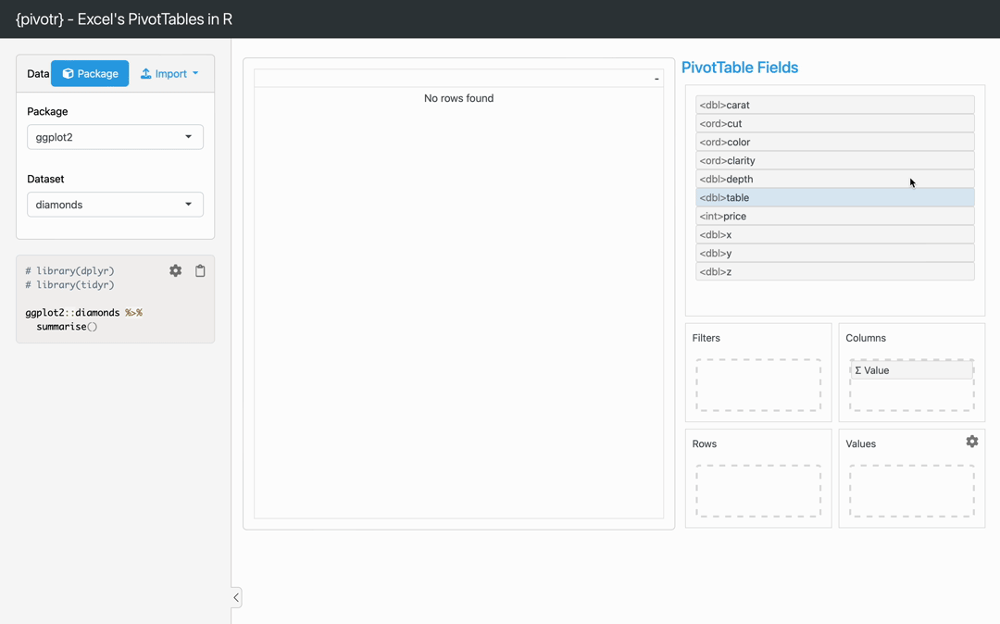

# {pivotr} - Excel's PivotTables in R

A shiny implementation of Excel's PivotTables. Perform your
aggregation/pivoting in the GUI, then copy the dplyr/tidyr code into
your R script 💫

## Installation

{pivotr} can be installed from GitHub as follows:

``` r
pak::pak("wurli/pivotr")
```

Once installed, launch the GUI using `pivotr::pivotr()`.

## Demo


